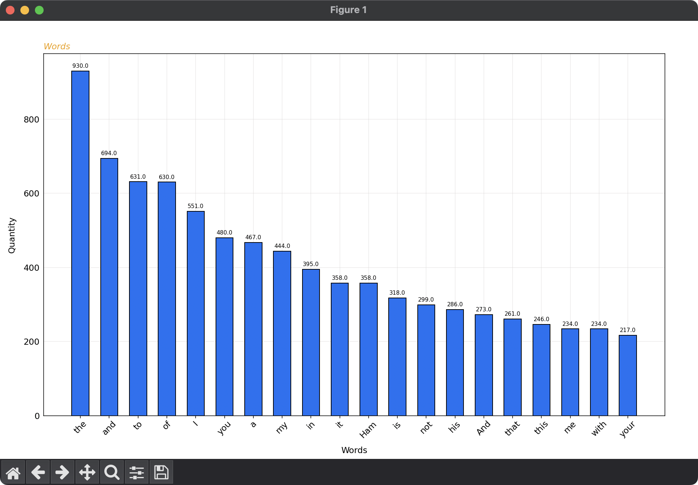
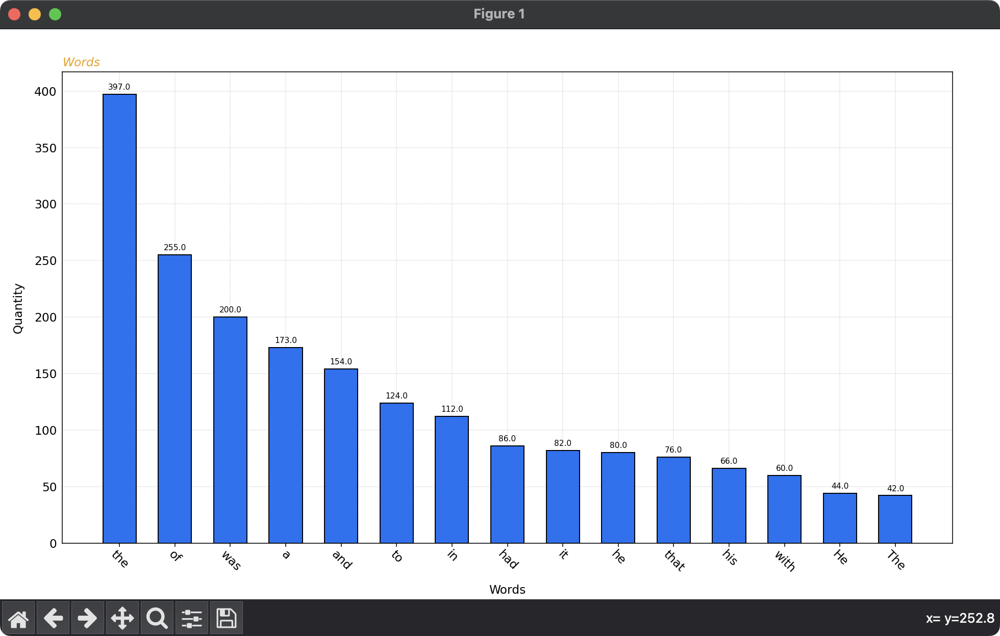

# wfreq
Word frequency bar chart generator.
## Demos
### Hamlet
```shell-session
$ lua wfreq.lua --file hamlet.txt -m 20 -- --title "Words" --rotation 45 --label -x "Words" -y "Quantity"
```


### 1984
```shell-session
$ lua wfreq.lua -f 1984.txt -m 15 -- --title 'Words' --rotation -45 --label -x "Words" -y "Quantity"
```

### Help
```shell-session
$ lua wfreq.lua --help
```

```
Usage: wfreq [-h] [--max NUM] --file FILE [--version] [<pygram>] ...

Linkage script beetween Lab_4.4 and Pygram.

Arguments:
   pygram

Options:
   -h, --help            Show this help message and exit.
   --max NUM,            Max word count returned from Lab 4.4. Also the max bars
      -m NUM             to be shown in Pygram.
   --file FILE,          Input text file.
       -f FILE
   --version, -v         Print version and exit.

Typical format:
  $ wfreq <wfreq.lua options> [-- <pygram.py options>]
Where:
   <wfreq.lua options> Are shown above.
   <pygram.py options> You can check them with
                       $ python3 Pygram/pygram.py --help

Example usage:
  $ lua wfreq.lua -f hamlet.txt -m 20 -- --title Words --rotation 90
    --label -x "Words" -y "Quantity"
```

## Getting started
1. Clone the repo with `git`
    ```shell-session
    $ git clone --recurse-submodules https://github.com/Dolfost/wfreq
    ```
1. Build the lab4.4 with `build.sh`
    ```shell-session
    $ cd Lab_4.4
    $ chmod +x build.sh
    $ cd ..
    ```
1. Install `Lua v5.3` and higher
    ```shell-session
    $ brew install lua
    ```
1. Install `luarocks`
    ```shell-session
    $ brew install luarocks
    ```
1. Install Lua dependencies
    ```shell-session
    $ luarocks install argparse
    ```
1. Install `python v3.0` and higher
    ```shell-session
    $ brew install python3
    ```
1. Install python dependencies
    ```shell-session
    $ pip install -U matplotlib
    ```
1. Ejoy!

Note that you might want to use different pakage manager than `homebrew`.
